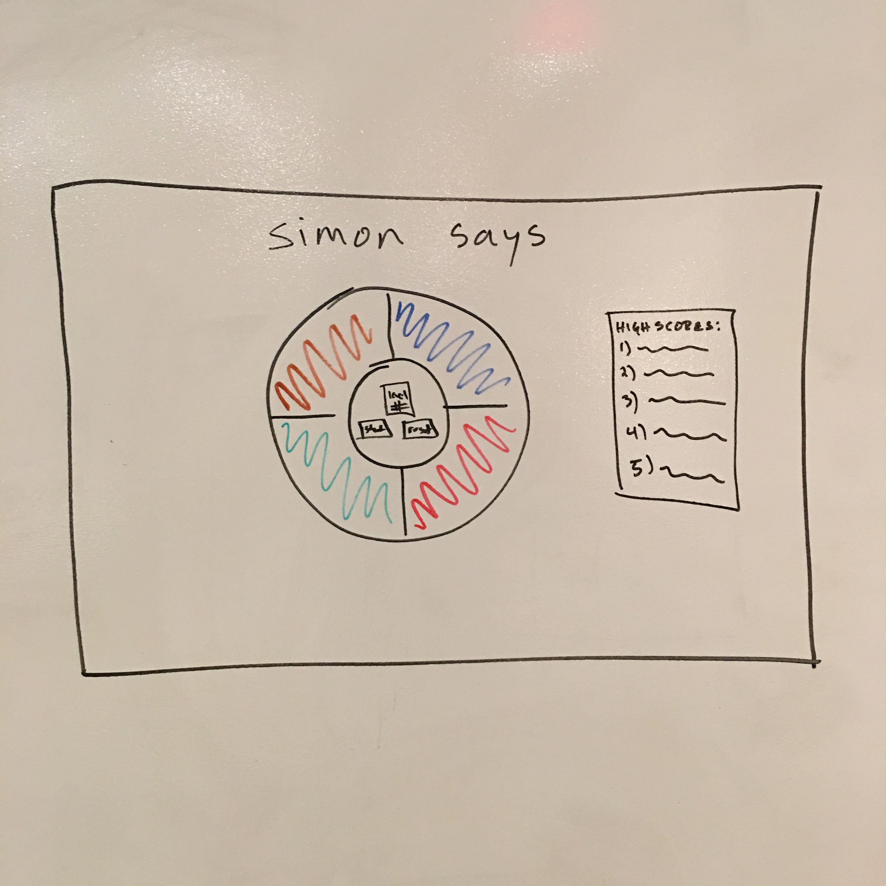

#Project 1: Simon Says
###Introduction

By the end of this project, I will have created a Simon Says game using technical skills learned during the first 2 weeks of WDI. I will use HTML, CSS, JavaScript, and jQuery to deliver to a web-based Simon Says game.

###Installation Instructions
Please click on the link at the top of the repository and load the game in your browser.
	
###Approach
This project will use CSS to style the web page and jQuery to manipulate the HTML file to make the page give the user a sequence of buttons to press based on randomized computer choices. 
###User Stories

<a href = "https://trello.com/b/GDVDD281/wdi-sm-43-project-1" target = "_blank">Trello</a>

###Technologies Used
  * HTML
  * CSS
  * JavaScript
  * jQuery

###Wireframe:

###Unresolved Issues:
There is an error associated with the play audio method on line 42 of app.js. Audio does not play properly when the user wins/loses so it has been removed for now. Additionally, I was not able to create a highscore table because I do not have a database. 